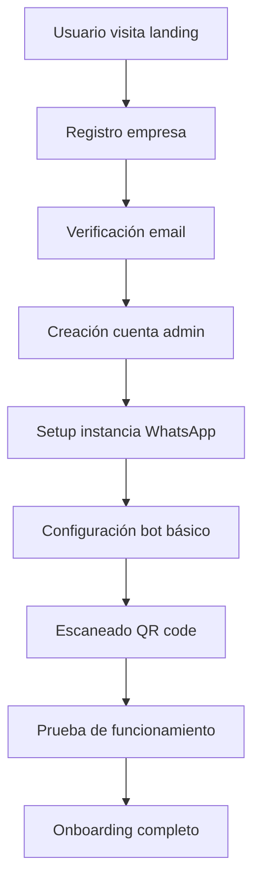
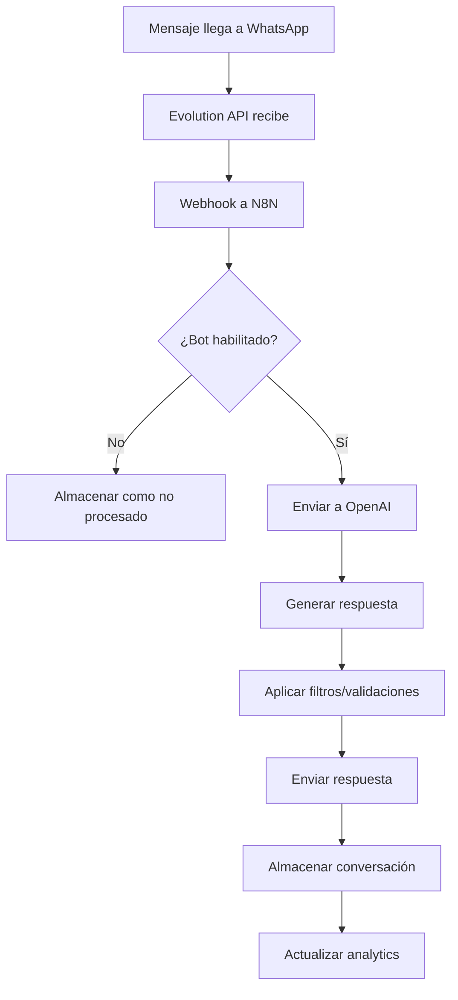
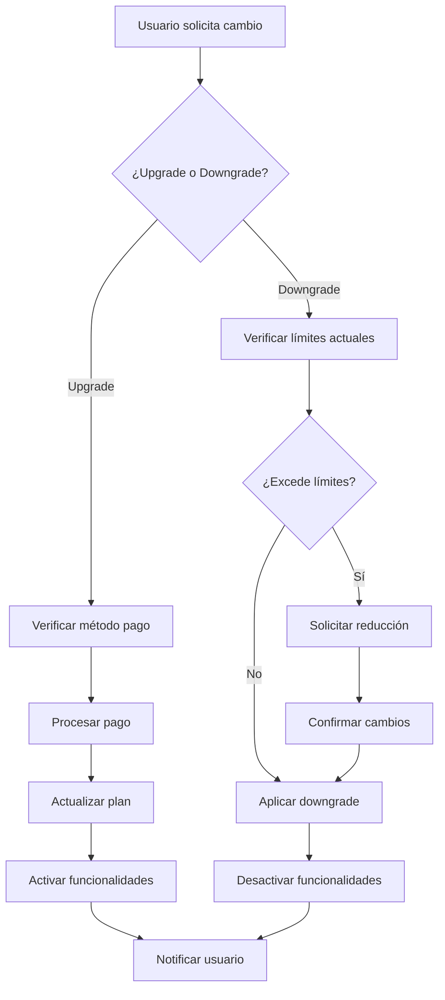
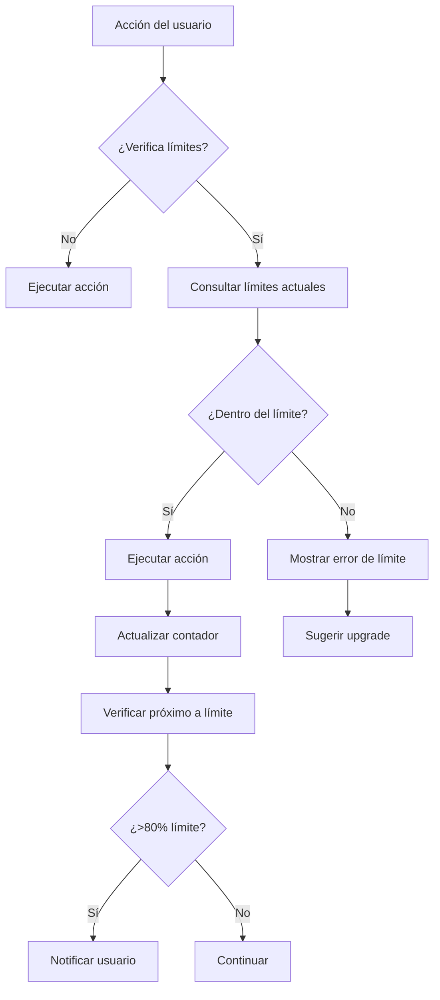
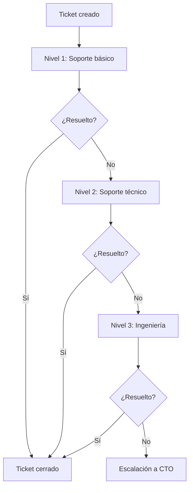

# Lógica de Negocio - WhatsApp Bot Platform

## 📋 Modelo de Negocio

### Visión General

WhatsApp Bot Platform es una **plataforma SaaS** que permite a empresas automatizar sus comunicaciones de WhatsApp mediante bots inteligentes potenciados por ChatGPT. El modelo de negocio se basa en:

- **Suscripciones mensuales** por plan
- **Límites por uso** (instancias y mensajes)
- **Escalabilidad** según necesidades empresariales
- **Integraciones premium** para planes superiores

### Propuesta de Valor

#### Para Pequeñas Empresas
- Automatización de respuestas básicas
- Atención 24/7 sin costos adicionales
- Reducción de carga operativa
- Mejora en tiempo de respuesta

#### Para Empresas Medianas
- Integración con sistemas existentes
- Analytics detallados
- Workflows automatizados
- Soporte prioritario

#### Para Grandes Corporaciones
- Soluciones personalizadas
- APIs dedicadas
- Soporte 24/7
- Integraciones avanzadas

## 💰 Planes y Precios

### Plan Starter - $29/mes
```
📊 Límites:
- 1 instancia de WhatsApp
- 1,000 mensajes/mes
- 1 bot por instancia
- Soporte básico por email

🤖 Funcionalidades:
- Bot con ChatGPT 3.5
- Respuestas automatizadas
- Dashboard básico
- Contactos hasta 500
- Historial 30 días

🔧 Integraciones:
- Webhooks básicos
- API REST limitada
- Exportación CSV
```

### Plan Business - $99/mes
```
📊 Límites:
- 3 instancias de WhatsApp
- 5,000 mensajes/mes
- 3 bots por instancia
- Soporte prioritario

🤖 Funcionalidades:
- Bot con ChatGPT 4
- Workflows avanzados
- Analytics detallados
- Contactos ilimitados
- Historial 90 días

🔧 Integraciones:
- N8N workflows
- CRM integrations
- API REST completa
- Webhooks avanzados
- Exportación múltiple
```

### Plan Enterprise - $299/mes
```
📊 Límites:
- Instancias ilimitadas
- Mensajes ilimitados
- Bots ilimitados
- Soporte 24/7

🤖 Funcionalidades:
- Bot con ChatGPT 4 + modelos custom
- IA personalizada
- Analytics avanzados + BI
- White-label opcional
- Historial ilimitado

🔧 Integraciones:
- Integración personalizada
- API dedicada
- Webhooks enterprise
- SSO/LDAP
- Backup automático
```

## 🏗️ Arquitectura del Sistema

### Flujo de Datos Principal

```
┌─────────────────┐    ┌─────────────────┐    ┌─────────────────┐
│   WhatsApp      │    │  Evolution API  │    │   N8N Workflow  │
│   (Cliente)     │◄──►│    (Puente)     │◄──►│ (Procesamiento) │
└─────────────────┘    └─────────────────┘    └─────────────────┘
                                │                       │
                                ▼                       ▼
                    ┌─────────────────┐    ┌─────────────────┐
                    │  Backend API    │    │   OpenAI API    │
                    │   (Node.js)     │◄──►│    (ChatGPT)    │
                    └─────────────────┘    └─────────────────┘
                                │
                                ▼
                    ┌─────────────────┐
                    │   PostgreSQL    │
                    │  (Persistencia) │
                    └─────────────────┘
```

### Componentes Clave

#### 1. Evolution API
**Propósito**: Interfaz con WhatsApp Business API
**Funciones**:
- Gestión de instancias WhatsApp
- Envío/recepción de mensajes
- Generación de QR codes
- Manejo de webhooks
- Estado de conexión

#### 2. N8N Workflows
**Propósito**: Automatización y procesamiento de lógica compleja
**Funciones**:
- Procesamiento de mensajes entrantes
- Activación de respuestas automáticas
- Integración con servicios externos
- Manejo de workflows empresariales

#### 3. OpenAI Integration
**Propósito**: Inteligencia artificial conversacional
**Funciones**:
- Generación de respuestas contextuales
- Análisis de intenciones
- Clasificación de mensajes
- Personalización de respuestas

#### 4. Backend API
**Propósito**: Orquestación central del sistema
**Funciones**:
- Autenticación y autorización
- Gestión de empresas y usuarios
- Configuración de bots
- Analytics y reportes

## 🔄 Flujos de Negocio

### 1. Flujo de Registro y Onboarding



#### Paso a Paso:

1. **Registro Inicial**
   - Usuario completa formulario empresa
   - Sistema crea empresa en plan Starter
   - Envío de email de bienvenida

2. **Configuración de Admin**
   - Creación usuario administrador
   - Generación de token JWT
   - Acceso al dashboard

3. **Setup de Instancia**
   - Creación instancia WhatsApp
   - Configuración webhook URL
   - Generación QR code

4. **Configuración de Bot**
   - Prompt inicial por defecto
   - Configuración ChatGPT 3.5
   - Activación del bot

5. **Activación**
   - Escaneo QR code
   - Conexión WhatsApp Business
   - Prueba de primer mensaje

### 2. Flujo de Procesamiento de Mensajes



#### Detalle del Procesamiento:

1. **Recepción del Mensaje**
   - WhatsApp → Evolution API
   - Validación de instancia activa
   - Extracción de metadata

2. **Procesamiento en N8N**
   - Webhook recibe mensaje
   - Verificación de configuración bot
   - Clasificación del tipo de mensaje

3. **Generación de Respuesta**
   - Envío a OpenAI con context
   - Aplicación de system prompt
   - Generación de respuesta contextual

4. **Validación y Filtros**
   - Verificación de contenido apropiado
   - Aplicación de reglas de negocio
   - Limites de caracteres/tokens

5. **Envío y Almacenamiento**
   - Respuesta via Evolution API
   - Almacenamiento en PostgreSQL
   - Actualización de métricas

### 3. Flujo de Upgrade/Downgrade de Plan



#### Consideraciones por Plan:

**Upgrade (Starter → Business)**:
- Aumento inmediato de límites
- Acceso a ChatGPT 4
- Activación de analytics avanzados
- Habilitación de workflows N8N

**Downgrade (Business → Starter)**:
- Verificación de instancias activas
- Desactivación de bots excedentes
- Migración a ChatGPT 3.5
- Preservación de datos históricos

### 4. Flujo de Manejo de Límites



#### Tipos de Límites:

1. **Límites de Instancias**
   - Starter: 1 instancia
   - Business: 3 instancias
   - Enterprise: Ilimitadas

2. **Límites de Mensajes**
   - Contador mensual por empresa
   - Reset automático cada mes
   - Notificaciones en 80% y 95%

3. **Límites de Funcionalidades**
   - Modelos de IA disponibles
   - Integraciones habilitadas
   - Nivel de soporte

## 🤖 Lógica de Bots y ChatGPT

### Sistema de Prompts

#### Prompt Base del Sistema
```
Eres un asistente virtual de WhatsApp para la empresa {COMPANY_NAME}.

Contexto:
- Empresa: {COMPANY_NAME}
- Tipo de negocio: {BUSINESS_TYPE}
- Personalidad: {BOT_PERSONALITY}
- Idioma principal: Español

Instrucciones:
1. Responde de manera profesional y amigable
2. Mantén respuestas concisas (máximo 300 caracteres)
3. Si no sabes algo, deriva a un humano
4. Usa emojis apropiados pero con moderación
5. Nunca proporciones información personal de la empresa

Información de la empresa:
{COMPANY_INFO}

Horario de atención:
{BUSINESS_HOURS}
```

#### Personalización por Industria

**E-commerce**:
```
Especialidades:
- Información de productos
- Estado de pedidos
- Políticas de devolución
- Promociones actuales

Frases clave:
- "¿En qué puedo ayudarte con tu compra?"
- "¿Tienes alguna pregunta sobre nuestros productos?"
- "Puedo ayudarte con información de tu pedido"
```

**Servicios Profesionales**:
```
Especialidades:
- Agendar citas
- Información de servicios
- Presupuestos
- Consultas técnicas

Frases clave:
- "¿Te gustaría agendar una consulta?"
- "¿Qué servicio te interesa?"
- "Puedo ayudarte con información sobre nuestros servicios"
```

### Configuración de Modelos

#### ChatGPT 3.5 (Starter)
```json
{
  "model": "gpt-3.5-turbo",
  "temperature": 0.7,
  "max_tokens": 150,
  "top_p": 1,
  "frequency_penalty": 0,
  "presence_penalty": 0
}
```

#### ChatGPT 4 (Business/Enterprise)
```json
{
  "model": "gpt-4",
  "temperature": 0.8,
  "max_tokens": 300,
  "top_p": 1,
  "frequency_penalty": 0.1,
  "presence_penalty": 0.1
}
```

### Manejo de Contexto

#### Contexto de Conversación
```javascript
// Estructura del contexto
{
  "conversation_id": "uuid",
  "contact_phone": "+1234567890",
  "contact_name": "Juan Pérez",
  "conversation_history": [
    {
      "role": "user",
      "content": "Hola, ¿tienen productos en stock?",
      "timestamp": "2025-01-15T10:30:00Z"
    },
    {
      "role": "assistant",
      "content": "¡Hola Juan! Sí, tenemos stock disponible. ¿Qué producto específico te interesa?",
      "timestamp": "2025-01-15T10:30:15Z"
    }
  ],
  "last_interaction": "2025-01-15T10:30:00Z",
  "context_metadata": {
    "previous_topics": ["productos", "stock"],
    "customer_intent": "consulta_productos",
    "conversation_stage": "discovery"
  }
}
```

## 🔗 Integraciones y Webhooks

### N8N Workflows

#### Workflow Base de Mensajes
```json
{
  "name": "WhatsApp Message Processing",
  "nodes": [
    {
      "name": "Webhook",
      "type": "n8n-nodes-base.webhook",
      "parameters": {
        "httpMethod": "POST",
        "path": "whatsapp-message"
      }
    },
    {
      "name": "Message Validation",
      "type": "n8n-nodes-base.function",
      "parameters": {
        "functionCode": "// Validar mensaje entrante\nif (!items[0].json.message) {\n  throw new Error('Mensaje inválido');\n}\nreturn items;"
      }
    },
    {
      "name": "OpenAI Request",
      "type": "n8n-nodes-base.openAi",
      "parameters": {
        "operation": "chat",
        "model": "gpt-4",
        "messages": "={{JSON.stringify(items[0].json.context)}}"
      }
    },
    {
      "name": "Send Response",
      "type": "n8n-nodes-base.httpRequest",
      "parameters": {
        "method": "POST",
        "url": "https://evolution-api.com/message/sendText",
        "body": "={{JSON.stringify(items[0].json.response)}}"
      }
    }
  ]
}
```

#### Workflow de Integración CRM
```json
{
  "name": "CRM Integration",
  "nodes": [
    {
      "name": "New Contact Trigger",
      "type": "n8n-nodes-base.webhook"
    },
    {
      "name": "HubSpot Create Contact",
      "type": "n8n-nodes-base.hubspot",
      "parameters": {
        "operation": "create",
        "resource": "contact"
      }
    },
    {
      "name": "Update Internal Database",
      "type": "n8n-nodes-base.postgres",
      "parameters": {
        "operation": "insert",
        "table": "contacts"
      }
    }
  ]
}
```

### Sistema de Webhooks

#### Webhook Entrante (WhatsApp → Sistema)
```javascript
// Estructura del webhook entrante
{
  "event": "message.received",
  "timestamp": "2025-01-15T10:30:00Z",
  "instance_id": "uuid",
  "data": {
    "message": {
      "id": "msg_id",
      "from": "+1234567890",
      "to": "+0987654321",
      "type": "text",
      "content": "Hola, ¿tienen productos en stock?",
      "timestamp": "2025-01-15T10:30:00Z"
    },
    "contact": {
      "phone": "+1234567890",
      "name": "Juan Pérez",
      "profilePicture": "https://..."
    }
  }
}
```

#### Webhook Saliente (Sistema → Cliente)
```javascript
// Webhook para notificar al cliente
{
  "event": "message.sent",
  "timestamp": "2025-01-15T10:30:15Z",
  "instance_id": "uuid",
  "data": {
    "message": {
      "id": "msg_id",
      "from": "+0987654321",
      "to": "+1234567890",
      "type": "text",
      "content": "¡Hola Juan! Sí, tenemos stock disponible...",
      "timestamp": "2025-01-15T10:30:15Z"
    },
    "bot_response": true,
    "processing_time": "2.5s"
  }
}
```

## 📊 Analytics y Métricas

### KPIs Principales

#### Métricas de Negocio
```
📈 Revenue Metrics:
- MRR (Monthly Recurring Revenue)
- ARR (Annual Recurring Revenue)
- ARPU (Average Revenue Per User)
- Churn Rate
- Upgrade/Downgrade Rate

👥 User Metrics:
- Total Companies
- Active Users
- New Registrations
- User Retention Rate
- Feature Adoption Rate

💬 Usage Metrics:
- Total Messages Processed
- Messages per Company
- Active Instances
- Bot Response Rate
- Average Response Time
```

#### Métricas por Empresa
```
📊 Company Dashboard:
- Messages this month vs limit
- Response time average
- Bot effectiveness rate
- Top contacts by interaction
- Peak usage hours

📈 Historical Analysis:
- Message volume trends
- Response time evolution
- Contact growth rate
- Conversation outcomes
- Popular topics/keywords
```

### Sistema de Reportes

#### Reporte Mensual Automatizado
```javascript
// Estructura del reporte mensual
{
  "company_id": "uuid",
  "period": "2025-01",
  "summary": {
    "total_messages": 850,
    "limit_messages": 1000,
    "usage_percentage": 85,
    "total_conversations": 45,
    "avg_response_time": "2.5s",
    "bot_effectiveness": "92%"
  },
  "trends": {
    "message_volume": "+15% vs last month",
    "response_time": "-0.5s improvement",
    "new_contacts": "+8 contacts",
    "satisfaction_score": "4.6/5"
  },
  "recommendations": [
    "Consider upgrading to Business plan",
    "Optimize bot responses for common queries",
    "Review peak hours for better coverage"
  ]
}
```

## 🔒 Seguridad y Compliance

### Medidas de Seguridad

#### Autenticación y Autorización
```
🔐 Authentication:
- JWT tokens con expiración
- Password hashing con bcrypt
- Rate limiting por IP
- Session management
- 2FA opcional (Business+)

👤 Authorization:
- Role-based access control
- Resource-level permissions
- Company data isolation
- API key management
- Audit logging
```

#### Protección de Datos
```
🛡️ Data Protection:
- Encryption at rest (AES-256)
- Encryption in transit (TLS 1.3)
- PII data masking
- Automatic data purging
- Backup encryption

📝 Compliance:
- GDPR compliance
- CCPA compliance
- SOC 2 Type II
- ISO 27001 preparation
- Regular security audits
```

### Manejo de Datos Sensibles

#### Información Personal
```javascript
// Anonimización de datos
{
  "contact_id": "uuid",
  "phone_number_hash": "sha256_hash",
  "name": "masked_name",
  "message_content": "encrypted_content",
  "metadata": {
    "country": "US",
    "language": "en",
    "interaction_count": 5
  }
}
```

#### Retención de Datos
```
📅 Data Retention Policy:
- Messages: 90 days (Starter), 1 year (Business), 2 years (Enterprise)
- Contacts: Permanent (can be deleted by user)
- Analytics: 2 years aggregated data
- Logs: 30 days detailed, 1 year summary
- Backups: 90 days retention
```

## 🚀 Escalabilidad y Performance

### Límites Técnicos

#### Capacidad del Sistema
```
📊 Current Limits:
- 1000 requests/minute per instance
- 10MB max message size
- 100 concurrent webhooks
- 1000 bot configurations
- 10,000 contacts per company

⚡ Performance Targets:
- <2s average response time
- 99.9% uptime SLA
- <100ms database queries
- 5MB/s webhook throughput
- 50,000 messages/day capacity
```

#### Optimizaciones Implementadas
```
🔄 Caching Strategy:
- Redis for session data
- CDN for static assets
- Database query caching
- OpenAI response caching
- Webhook response buffering

📈 Scaling Approach:
- Horizontal scaling with load balancer
- Database read replicas
- Microservices architecture
- Container orchestration
- Auto-scaling based on metrics
```

### Planes de Crecimiento

#### Fase 1: MVP (Actual)
- 1000 companies capacity
- Basic feature set
- Single region deployment
- Standard support

#### Fase 2: Growth
- 10,000 companies capacity
- Advanced features
- Multi-region deployment
- Premium support

#### Fase 3: Enterprise
- 100,000 companies capacity
- Custom features
- Global deployment
- White-label solutions

## 📞 Soporte y Atención al Cliente

### Niveles de Soporte

#### Plan Starter
```
📧 Email Support:
- Response time: 24-48 hours
- Business hours only
- Basic troubleshooting
- Knowledge base access
- Community forum
```

#### Plan Business
```
🚀 Priority Support:
- Response time: 4-8 hours
- Extended hours support
- Advanced troubleshooting
- Phone support
- Priority feature requests
```

#### Plan Enterprise
```
⚡ Premium Support:
- Response time: 1-2 hours
- 24/7 availability
- Dedicated account manager
- Custom integration support
- SLA guarantees
```

### Proceso de Escalación



## 🎯 Casos de Uso Específicos

### E-commerce
```
🛒 Funcionalidades:
- Consulta de productos
- Estado de pedidos
- Información de envíos
- Soporte post-venta
- Notificaciones de stock

💡 Prompts especializados:
- "Consulta nuestro catálogo de productos"
- "Verifica el estado de tu pedido"
- "Información sobre políticas de devolución"
```

### Servicios Profesionales
```
📅 Funcionalidades:
- Agendar citas
- Información de servicios
- Presupuestos básicos
- Consultas técnicas
- Seguimiento de proyectos

💡 Prompts especializados:
- "Agenda tu consulta gratuita"
- "Obtén información sobre nuestros servicios"
- "Solicita un presupuesto personalizado"
```

### Restaurantes
```
🍽️ Funcionalidades:
- Consulta de menú
- Realizar pedidos
- Información de horarios
- Promociones especiales
- Reservas de mesa

💡 Prompts especializados:
- "Consulta nuestro menú del día"
- "Realiza tu pedido para delivery"
- "Reserva tu mesa para hoy"
```

## 📈 Roadmap y Futuro

### Q1 2025
- [ ] Implementación completa del MVP
- [ ] Lanzamiento de planes Starter y Business
- [ ] Integración básica con N8N
- [ ] Dashboard de analytics

### Q2 2025
- [ ] Plan Enterprise
- [ ] Integraciones CRM (HubSpot, Salesforce)
- [ ] Apps móviles (iOS/Android)
- [ ] Multi-idioma

### Q3 2025
- [ ] White-label solutions
- [ ] API pública
- [ ] Marketplace de integraciones
- [ ] IA personalizada

### Q4 2025
- [ ] Chatbots de voz
- [ ] Integraciones avanzadas
- [ ] Expansion internacional
- [ ] Enterprise features

---

**Última actualización**: Julio 2025  
**Versión**: 1.0.0  
**Business Logic**: Fede Glanz 